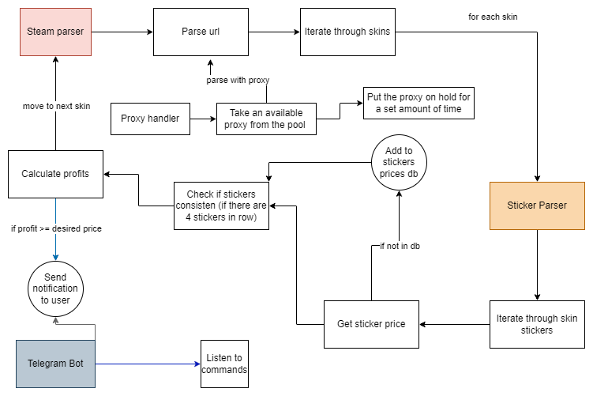
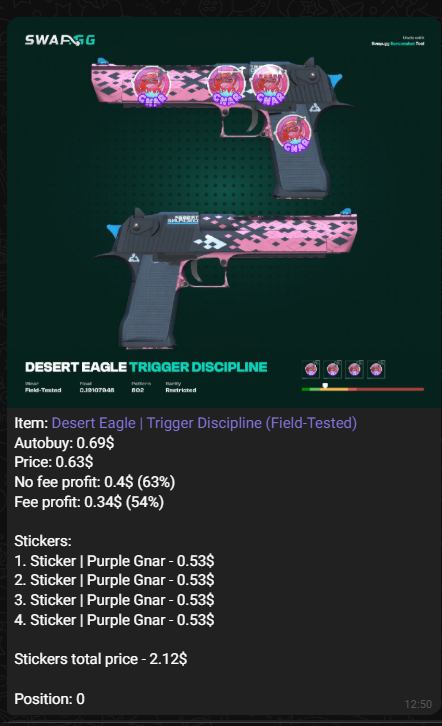

## 📦 CS2 Skins Market Parser

A Python-based system for monitoring CS2 skins and stickers on the **Steam Community Market**.
The parser reads skin IDs from a `marketplaceids.json` file, checks skins stickers price, and sends Telegram notifications when a profitable deal is found.

---

## 📌 Features

* **Steam Community Market stickers parsing**
* **Sticker detection on skins**
* **Sticker prices saving in database**
* **Profitability calculation based on stickers**
* **Telegram bot notifications**
* **Proxy support (HTTP/SOCKS4/SOCKS5)**
* **Docker & Docker Compose setup**

---

## ⚙️ Tech Stack

* Python 3.11+
* [aiohttp](https://docs.aiohttp.org/en/stable/)
* [BeautifulSoup4](https://www.crummy.com/software/BeautifulSoup/bs4/doc/)
* [python-telegram-bot](https://docs.python-telegram-bot.org/en/stable/)
* FastAPI / Uvicorn (for telegram bot endpoints)
* Docker / Docker Compose

---

## 📊 Simplified workflow diagram



## 📸 Telegram Notification Example



## 📁 Project Structure

```
steam-parser/
│
├── data/
│   ├── config.py              # Config file
│   ├── currency.json          # File with actual currency rates
│   ├── marketplaceids.json    # Items to parse
│   ├── proxies.txt            # List of proxies
│   ├── stickers.db            # Db of parsed stickers
│   └── wrong.txt              # Wrong stickers
│
├── misc/
│   ├── proxy_manager.py
│   └── telegram_bot.py
│
├── skins/
│   ├── __init__.py
│   ├── filter_skins.py        # Script for filtering marketplaceids.json
│   └── skins.py
│
├── steam/
│   ├── __init__.py
│   ├── steam_currency.py
│   └── steam_parser.py
│
├── stickers/
│   ├── __init__.py
│   ├── stickers.py
│   ├── stickers_db.py
│   └── stickers_parser.py
│
├── telegram-bot/
    ├── bot.py
│   ├── Dockerfile
│   ├── requirements.txt
│   └── stickers_parser.py

├── .env
│   docker-compose.yml
│   Dockerfile
│   main.py
│   parser.py
│   requirements.txt
└── README.md
```

---

## 🛠️ Setup Instructions

### 1️⃣ Add Proxies

Create and fill the `data/proxies.txt` file with proxies in the following format:

```
http://user:pass@ip:port
http://ip:port
socks5://user:pass@ip:port
socks4://ip:port
```

Each proxy should be on a new line.

---

### 2️⃣ Add Steam Market Item IDs

Fill `data/marketplaceids.json` with the Market hash names to parse:

```json
{
    "items": {
      "M4A4 | Griffin (Field-Tested)": {
      },
      ...
    }
}
```

You can get the actual market id's here: https://github.com/ModestSerhat/cs2-marketplace-ids

---

### 3️⃣ Configure Environment Variables

Create a `.env` file:

```
TELEGRAM_API_TOKEN=your_telegram_bot_token
TELEGRAM_USER_ID=your_user_id
```

---

### 4️⃣ Setup config.py file

Set your preferences like cooldown time, profit margin, etc. in `data/config.py`:


---

### 5️⃣  Run via Docker Compose

```bash
docker compose up --build
```

---

## 🐍 Telegram Bot Commands

| Command                  | Description              |
|:-------------------------|:-------------------------|
| `/pause`                 | Pauses bot               |
| `/resume`                | Resumes bot              |

---

## 📊 How It Works

* **steam\_parser.py** scrapes skin prices and sticker info from the Steam market.
* **proxy\_manager.py** rotates proxies to avoid rate limits.
* **stickers\_parser.py** parses stickers of the skin, manages the database, determines if skin is profitable.
* Profitable offers are pushed to the **telegram\_bot.py** for Telegram notifications.

---


